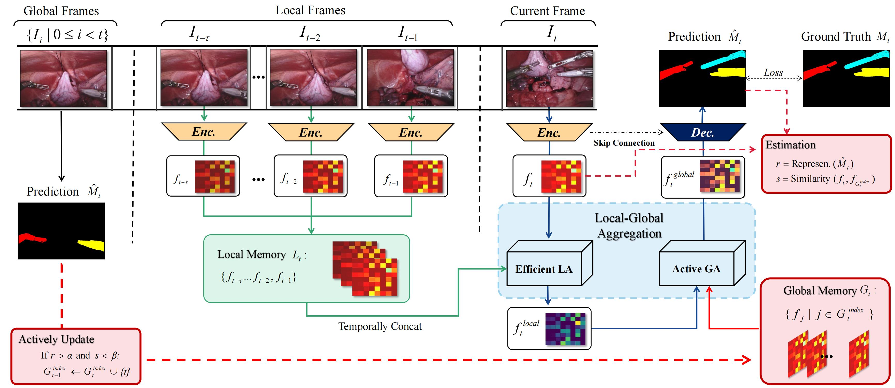

# Efficient Global-Local Memory for Real-time Instrument Segmentation of Robotic Surgical Video
Performing a real-time and accurate instrument segmentation from videos is of great significance for improving the performance of robotic-assisted surgery. We identify two important clues for surgical instrument perception, including local temporal dependency from adjacent frames and global semantic correlation in long-range duration. However, most existing works perform segmentation purely using visual cues in a single frame. Optical flow is just used to model the motion between only two frames and brings heavy computational cost. We propose a novel dual-memory network (DMNet) to wisely relate both global and local spatio-temporal knowledge to augment the current features, boosting the segmentation performance and retaining the real-time prediction capability. We propose, on the one hand, an efficient local memory by taking the complementary advantages of convolutional LSTM and non-local mechanisms towards the relating reception field. On the other hand, we develop an active global memory to gather the global semantic correlation in long temporal range to current one, in which we gather the most informative frames derived from model uncertainty and frame similarity. We have extensively validated our method on two public benchmark surgical video datasets. Experimental results demonstrate that our method largely outperforms the state-of-the-art works on segmentation accuracy while maintaining a real-time speed.

This paper has been accepted by [MICCAI](https://link.springer.com/chapter/10.1007/978-3-030-87202-1_33).
Get the full paper on [Arxiv](https://arxiv.org/abs/2109.13593).


Fig. 1. Structure of DMNet.

## Code List

- [x] Pre-processing
- [x] Training Codes
- [ ] Network

For more details or any questions, please feel easy to contact us by email ^\_^

## Usage


## Citation
If you find DMNet useful in your research, please consider citing:

```
@inproceedings{wang2021efficient,
  title={Efficient Global-Local Memory for Real-Time Instrument Segmentation of Robotic Surgical Video},
  author={Wang, Jiacheng and Jin, Yueming and Wang, Liansheng and Cai, Shuntian and Heng, Pheng-Ann and Qin, Jing},
  booktitle={International Conference on Medical Image Computing and Computer-Assisted Intervention},
  pages={341--351},
  year={2021},
  organization={Springer}
}
```

